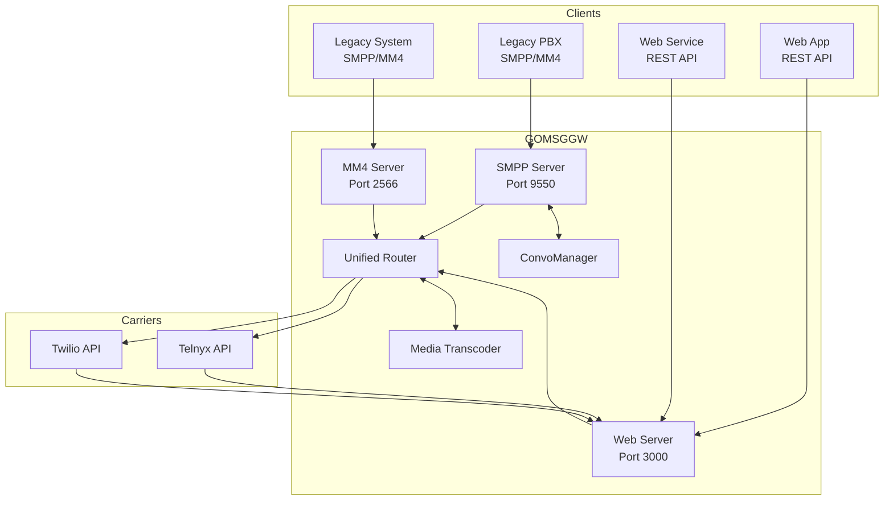
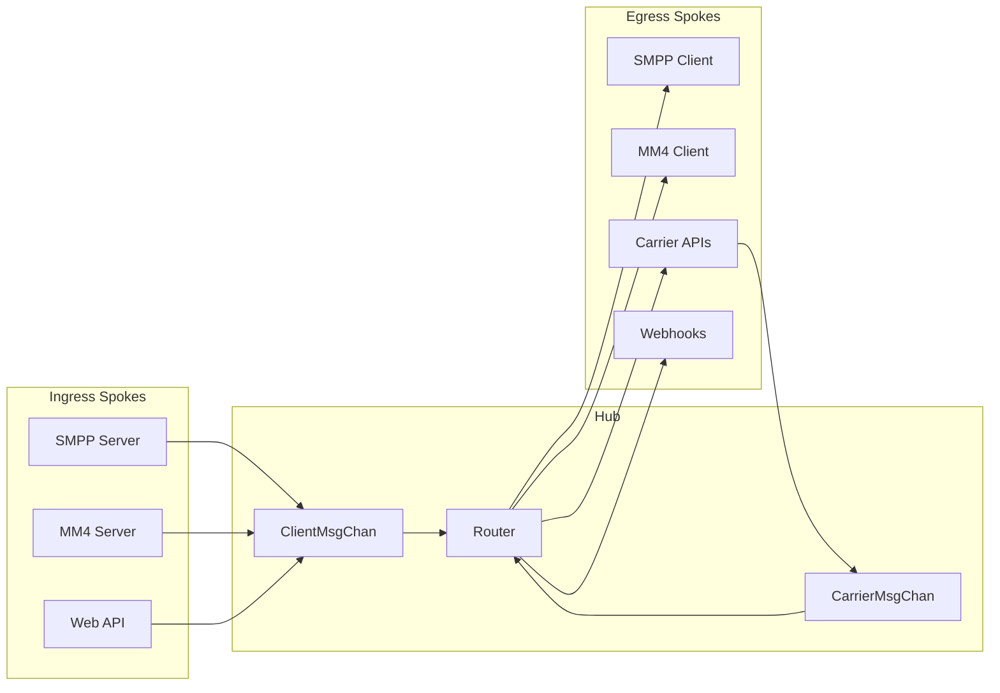
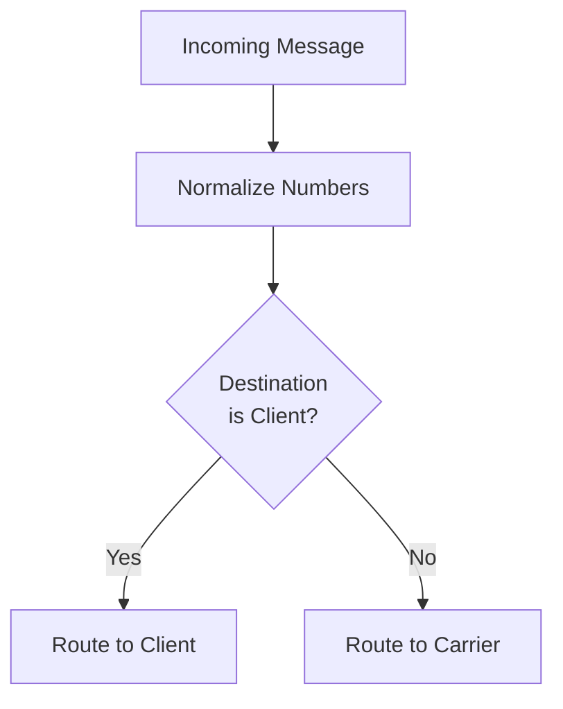
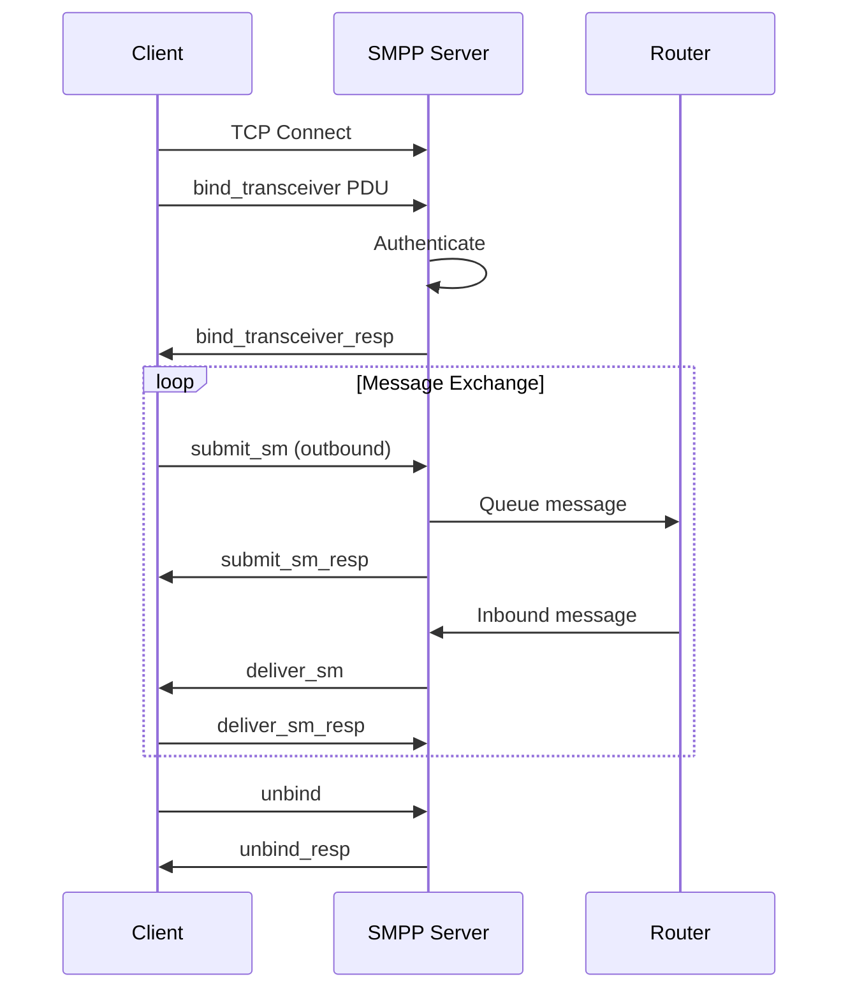
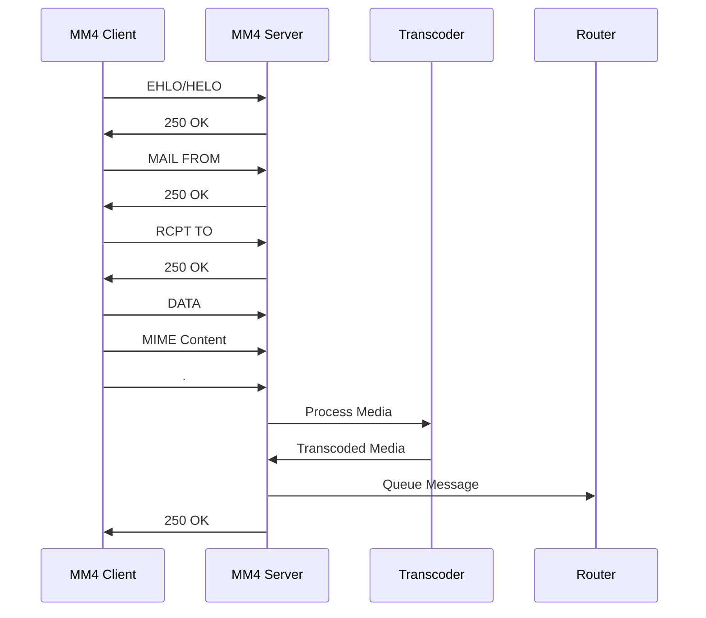
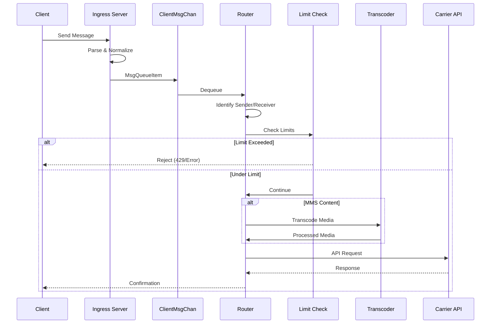
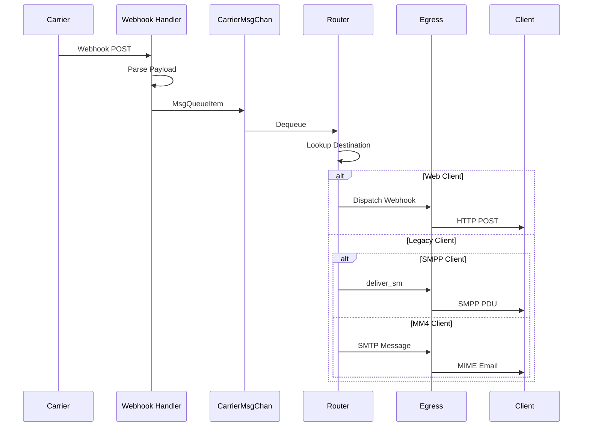
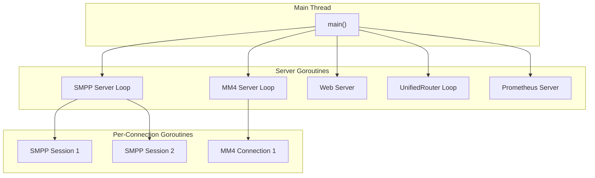

# GOMSGGW Architecture

Comprehensive system design and component documentation for the GOMSGGW messaging gateway.

## Table of Contents

1. [System Overview](#system-overview)
2. [Core Architecture](#core-architecture)
3. [Component Details](#component-details)
4. [Data Flow](#data-flow)
5. [Concurrency Model](#concurrency-model)
6. [Client Types](#client-types)

---

## System Overview

`gomsggw` is a high-throughput, multi-protocol message gateway designed to bridge traditional telecom protocols (SMPP/MM4) with modern web technologies. It serves as a central hub for:

- **Routing**: Directing messages between clients and carriers
- **Transcoding**: Normalizing MMS content for carrier compatibility
- **Rate Limiting**: Enforcing usage quotas
- **Protocol Translation**: Converting between SMPP, MM4, and HTTP



---

## Core Architecture

### Hub-and-Spoke Model

The gateway follows a hub-and-spoke architecture:

- **Hub (Router)**: Central message dispatcher that receives all traffic
- **Spokes (Servers)**: Protocol-specific ingress/egress points



### Message Flow

Every message follows this general path:

1. **Ingestion**: Received by protocol-specific server
2. **Normalization**: Numbers converted to E.164, metadata extracted
3. **Queuing**: Placed in appropriate channel (Client or Carrier)
4. **Routing**: Router determines destination and path
5. **Processing**: Transcoding applied if needed (MMS)
6. **Dispatch**: Sent to destination via appropriate egress

---

## Component Details

### Router (`router.go`)

The brain of the system. Runs a continuous `UnifiedRouter` loop.

**Responsibilities:**
- Monitor `ClientMsgChan` and `CarrierMsgChan`
- Normalize phone numbers to E.164 format
- Lookup senders and receivers via in-memory maps
- Apply routing rules (internal vs external)
- Enforce usage limits
- Dispatch to appropriate egress

**Key Data Structures:**
```go
type Router struct {
    gateway          *Gateway
    Routes           []*Route
    ClientMsgChan    chan MsgQueueItem  // From clients
    CarrierMsgChan   chan MsgQueueItem  // From carriers
    MessageAckStatus chan MsgQueueItem  // Delivery confirmations
}
```

**Routing Logic:**


### SMS Subsystem (`sms_server.go`)

Handles SMPP protocol connections for SMS traffic.

**Protocol**: SMPP v3.4  
**Transport**: Persistent TCP connections  
**Concurrency**: One goroutine per session

**Key Features:**
- `bind_transceiver` for bidirectional connections
- PDU (Protocol Data Unit) parsing and generation
- User Data Header (UDH) handling for long messages
- Delivery receipt management

**Session Lifecycle:**


### MMS Subsystem (`mms_server.go`)

Handles MM4 protocol (SMTP-based) for MMS traffic.

**Protocol**: MM4 (SMTP)  
**Transport**: SMTP connections  
**Format**: MIME Multipart

**Key Features:**
- SMTP handshake handling
- MIME parsing for multimedia content
- Client identification by IP address
- Session state tracking via `MM4ClientState`

**MM4 Flow:**


### Web Subsystem (`web_server.go`)

HTTP API server for management, carrier webhooks, and web clients.

**Framework**: Iris (high-performance Go web framework)  
**Authentication**: Basic Auth / API Keys

**Endpoint Categories:**
1. **Health & Monitoring**: `/health`, `/stats`
2. **Management**: `/clients`, `/carriers`, `/reload`
3. **Carrier Webhooks**: `/inbound/{carrier}`
4. **Web Client API**: `/messages/send`
5. **Media Serving**: `/media/{token}` (UUID-based access tokens for security)

### Transcoder (`mms_transcode.go`)

Media normalization pipeline for MMS content.

**Capabilities:**
- Image: Resize, compress, format conversion
- Video: Transcode to H.264, size optimization
- Audio: Convert to MP3/AMR

For detailed transcoding documentation, see [Transcoding](./transcoding.md).

### ConvoManager (`convo.go`)

Ensures message ordering for SMPP sessions.

**Purpose**: Manage in-flight windows to prevent message overtaking on the wire.

**Mechanism:**
- Track pending `submit_sm` operations
- Ensure responses correlate to correct requests
- Maintain sequence numbers

---

## Data Flow

### Outbound Message (Client → Carrier)



### Inbound Message (Carrier → Client)



---

## Concurrency Model

### Goroutine Architecture



### Channel Communication

| Channel | Direction | Purpose |
|---------|-----------|---------|
| `ClientMsgChan` | Client → Router | Outbound messages |
| `CarrierMsgChan` | Carrier → Router | Inbound messages |
| `MessageAckStatus` | Router → Server | Delivery confirmations |

### Thread Safety

- **In-memory maps**: Protected by `sync.RWMutex`
- **Database access**: Serialized through GORM
- **Channel operations**: Inherently thread-safe

---

## Client Types

GOMSGGW supports two primary client architectures:

### Legacy Clients

Traditional telecom equipment using standard protocols.

| Protocol | Use Case |
|----------|----------|
| SMPP | SMS sending/receiving |
| MM4 | MMS sending/receiving |

**Characteristics:**
- Persistent TCP connections
- Protocol-mandated message limits (160 chars SMS)
- Mandatory transcoding for MMS
- Automatic message splitting for long SMS

See [Legacy Clients](./legacy_clients.md) for details.

### Web Clients

Modern API-based integrations.

| Protocol | Use Case |
|----------|----------|
| REST API | Sending messages |
| Webhooks | Receiving messages |

**Characteristics:**
- HTTP-based, stateless connections
- Configurable message handling
- Optional transcoding bypass
- Rich JSON payloads

See [Web Clients](./web_clients.md) for details.

---

## Related Documentation

- [Data Models](./data_models.md) - Database schema
- [API Reference](./api_reference.md) - REST endpoints
- [Legacy Clients](./legacy_clients.md) - SMPP/MM4 details
- [Web Clients](./web_clients.md) - HTTP API details
- [Transcoding](./transcoding.md) - Media processing
- [Usage Limits](./usage_limits.md) - Rate limiting
- [Deployment](./deployment.md) - Operations guide
