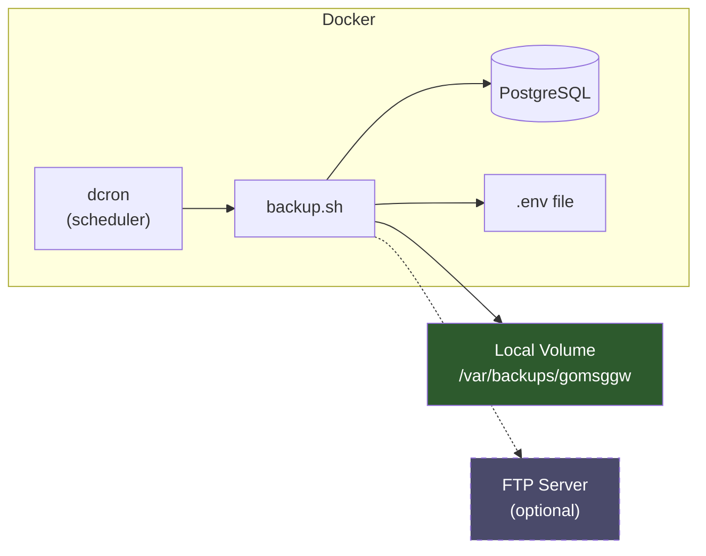

# GOMSGGW Backup System

This document describes the automated backup functionality for the GOMSGGW message gateway.

## Overview

The backup system provides:

- **PostgreSQL database backups** - Compressed SQL dumps
- **Configuration backups** - Encrypted `.env` file snapshots
- **Optional FTP upload** - Offsite storage to remote FTP server
- **Automated scheduling** - Docker-based cron execution
- **Retention management** - Automatic cleanup of old backups

---

## Components

| File | Purpose |
|------|---------|
| `scripts/backup.sh` | Core backup script (database + config) |
| `scripts/backup-entrypoint.sh` | Container entrypoint for scheduled backups |
| `Dockerfile.backup` | Docker image for backup container |

---

## Quick Start

### Manual Backup (One-time)

Run directly from the repository root:

```bash
# Backup everything (database + .env)
./scripts/backup.sh

# Database only
./scripts/backup.sh --db-only

# .env file only
./scripts/backup.sh --env-only
```

### Automated Backups (Docker)

Enable the backup container in `docker-compose.yml`:

```yaml
backup:
  build:
    context: .
    dockerfile: Dockerfile.backup
  container_name: gomsggw-backup
  env_file:
    - .env
  environment:
    - POSTGRES_HOST=postgres
    - BACKUP_SCHEDULE=0 2 * * *  # Daily at 2am
  volumes:
    - ./backups:/var/backups/gomsggw
    - ./.env:/app/.env:ro
  depends_on:
    - postgres
  restart: always
  networks:
    - gomsggw-network
```

Then start the backup service:

```bash
docker compose up -d backup
```

---

## Configuration

All settings are configured via environment variables:

### PostgreSQL Connection

| Variable | Default | Description |
|----------|---------|-------------|
| `POSTGRES_HOST` | `localhost` | Database host |
| `POSTGRES_PORT` | `5432` | Database port |
| `POSTGRES_USER` | `smsgw` | Database user |
| `POSTGRES_PASSWORD` | *(required)* | Database password |
| `POSTGRES_DB` | `smsgw` | Database name |

### Backup Settings

| Variable | Default | Description |
|----------|---------|-------------|
| `BACKUP_LOCAL_DIR` | `/var/backups/gomsggw` | Local backup directory |
| `BACKUP_RETENTION_DAYS` | `7` | Days to keep backups (0 = keep forever) |
| `BACKUP_SCHEDULE` | `0 2 * * *` | Cron expression for scheduled backups |
| `ENCRYPTION_KEY` | *(optional)* | AES-256 key for .env encryption |

### FTP Upload (Optional)

| Variable | Default | Description |
|----------|---------|-------------|
| `BACKUP_FTP_HOST` | *(empty)* | FTP server hostname |
| `BACKUP_FTP_PORT` | `21` | FTP port |
| `BACKUP_FTP_USER` | *(empty)* | FTP username |
| `BACKUP_FTP_PASSWORD` | *(empty)* | FTP password |
| `BACKUP_FTP_DIR` | `/gomsggw` | Remote directory |

---

## Backup Output

### Database Backups

- **Format**: Gzip-compressed SQL dump
- **Filename**: `db_<database>_<timestamp>.sql.gz`
- **Example**: `db_smsgw_20260112_020000.sql.gz`

### Configuration Backups

- **Format**: Encrypted (AES-256-CBC) or plain copy
- **Filename**: `env_<timestamp>.enc`
- **Example**: `env_20260112_020000.enc`

> [!TIP]
> Set `ENCRYPTION_KEY` to encrypt .env backups. Without it, backups are plain-text copies with `chmod 600` permissions.

---

## Usage Examples

### Run Manual Backup in Docker

```bash
docker exec gomsggw-backup /app/backup.sh
```

### View Backup Logs

```bash
docker exec gomsggw-backup tail -f /var/log/backup.log
```

### Restore Database from Backup

```bash
# Decompress and restore
gunzip -c backups/db_smsgw_20260112_020000.sql.gz | \
  docker exec -i gomsggw-db psql -U smsgw -d smsgw
```

### Decrypt .env Backup

```bash
openssl enc -aes-256-cbc -d -pbkdf2 \
  -in backups/env_20260112_020000.enc \
  -out restored.env \
  -pass pass:your-encryption-key
```

---

## Scheduling (Cron Expressions)

| Schedule | Expression |
|----------|------------|
| Daily at 2am | `0 2 * * *` |
| Every 6 hours | `0 */6 * * *` |
| Weekly Sunday 3am | `0 3 * * 0` |
| Every 12 hours | `0 0,12 * * *` |

---

## Architecture



---

## Security Notes

> [!IMPORTANT]
> - Mount `.env` as read-only (`:ro`) in the backup container
> - Set `ENCRYPTION_KEY` for encrypted configuration backups
> - Backup directory has `chmod 700` (owner-only access)
> - Use secure FTP (FTPS) when uploading to remote servers

---

## Troubleshooting

### Backup fails with "pg_dump: connection refused"

Ensure `POSTGRES_HOST` is set to `postgres` (not `localhost`) when running in Docker.

### FTP upload fails

The container supports both `lftp` and `curl`. Check FTP credentials and ensure the remote directory exists.

### Large backups take too long

Consider running backups during off-peak hours or increasing the cron interval.
