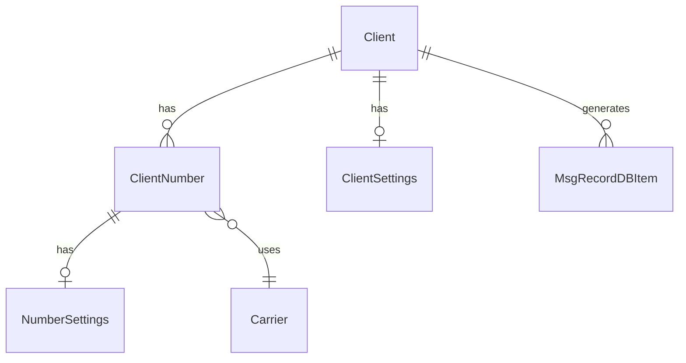

# Data Models

Complete reference for all database entities in GOMSGGW.

---

## Entity Relationship



---

## Client

Represents a messaging client (legacy or web).

| Field | Type | Description |
|-------|------|-------------|
| `id` | uint | Primary key |
| `username` | string | Unique username (SMPP System ID / API username) |
| `password` | string | Encrypted password (never returned in API) |
| `name` | string | Display name |
| `address` | string | Client address (IP or hostname) - required for legacy |
| `type` | string | `"legacy"` or `"web"` |
| `timezone` | string | IANA timezone for limit period calculation (default: UTC) |
| `log_privacy` | bool | Redact message content in logs |
| `settings` | *ClientSettings | Client settings (limits, webhooks) |
| `numbers` | []ClientNumber | Associated phone numbers |

### Address Field

For legacy clients, the `address` field is used for:
- **SMPP ACL**: Verify source IP on bind attempts
- **MM4 Delivery**: Resolve hostname to IP for MMS delivery
- **MM4 Inbound**: Verify source of incoming MMS messages

Supports both IP addresses (`192.168.1.10`) and hostnames (`pbx.example.com`). Hostnames are resolved at runtime.

### Example

```json
{
  "id": 1,
  "username": "zultys_mx",
  "name": "Zultys MX PBX",
  "type": "legacy",
  "address": "pbx.zultys.local",
  "timezone": "America/Vancouver",
  "settings": {...},
  "numbers": [...]
}
```

---

## ClientSettings

Settings applicable to all client types.

| Field | Type | Default | Description |
|-------|------|---------|-------------|
| `id` | uint | - | Primary key |
| `client_id` | uint | - | Foreign key to Client |
| **Auth & Format** ||||
| `auth_method` | string | basic | `basic` or `bearer` (how client authenticates) |
| `api_format` | string | generic | `generic` or `bicom` (request/response structure) |
| **Web-specific** ||||
| `disable_message_splitting` | bool | false | Deliver long messages as single payload |
| `webhook_retries` | int | 3 | Webhook retry attempts |
| `webhook_timeout_secs` | int | 10 | Webhook request timeout |
| `include_raw_segments` | bool | false | Include segment details in webhook |
| `default_webhook` | string | - | Fallback webhook URL |
| **SMS Limits** ||||
| `sms_burst_limit` | int64 | 0 | Per minute (0 = unlimited) |
| `sms_daily_limit` | int64 | 0 | Per day (0 = unlimited) |
| `sms_monthly_limit` | int64 | 0 | Per month (0 = unlimited) |
| **MMS Limits** ||||
| `mms_burst_limit` | int64 | 0 | Per minute (0 = unlimited) |
| `mms_daily_limit` | int64 | 0 | Per day (0 = unlimited) |
| `mms_monthly_limit` | int64 | 0 | Per month (0 = unlimited) |
| **Limit Behavior** ||||
| `limit_both` | bool | false | If true, limit applies to inbound+outbound |

### Authentication Methods

| auth_method | Header Format |
|-------------|---------------|
| `basic` | `Authorization: Basic <base64(username:password)>` |
| `bearer` | `Authorization: Bearer <base64(username:password)>` |

### API Formats

| api_format | Description |
|------------|-------------|
| `generic` | Standard format with optional `client_id` field |
| `bicom` | Bicom PBXware native format with `media_urls` |

### Example

```json
{
  "id": 1,
  "client_id": 2,
  "api_format": "bicom",
  "sms_daily_limit": 10000,
  "mms_daily_limit": 1000,
  "limit_both": false,
  "default_webhook": "https://bicom.local/smsservice/connector"
}
```

---

## ClientNumber

Phone numbers associated with clients.

| Field | Type | Description |
|-------|------|-------------|
| `id` | uint | Primary key |
| `client_id` | uint | Foreign key to Client |
| `number` | string | E.164 format, digits only (e.g., `12505551234`) |
| `carrier` | string | Carrier name for outbound routing |
| `tag` | string | Organizational tag |
| `group` | string | Number grouping |
| `ignore_stop_cmd_sending` | bool | Skip automatic STOP message handling |
| `webhook` | string | Number-specific webhook URL |
| `settings` | *NumberSettings | Per-number settings (overrides) |

### Number Normalization

Numbers are automatically normalized on creation:
- `+1-250-555-1234` → `12505551234`
- Leading `+` stripped
- Non-digit characters removed

---

## NumberSettings

Per-number configuration that overrides ClientSettings.

| Field | Type | Default | Description |
|-------|------|---------|-------------|
| `id` | uint | - | Primary key |
| `number_id` | uint | - | Foreign key to ClientNumber |
| **SMS Limits** (0 = use client setting) ||||
| `sms_burst_limit` | int64 | 0 | Per minute |
| `sms_daily_limit` | int64 | 0 | Per day |
| `sms_monthly_limit` | int64 | 0 | Per month |
| **MMS Limits** (0 = use client setting) ||||
| `mms_burst_limit` | int64 | 0 | Per minute |
| `mms_daily_limit` | int64 | 0 | Per day |
| `mms_monthly_limit` | int64 | 0 | Per month |
| **Limit Behavior** ||||
| `limit_both` | bool | false | Override: apply to inbound too |

### Limit Resolution Priority

1. **NumberSettings** (if > 0)
2. **ClientSettings**
3. **Unlimited** (default)

---

## Carrier

Carrier configuration for outbound routing.

| Field | Type | Description |
|-------|------|-------------|
| `id` | uint | Primary key |
| `name` | string | Unique carrier identifier |
| `type` | string | Carrier type: `"telnyx"`, `"twilio"` |
| `username` | string | Encrypted API credentials (e.g., API key, Account SID) |
| `password` | string | Encrypted API credentials (e.g., API secret, Auth Token) |
| `uuid` | string | Internal UUID for inbound webhook routing |
| `profile_id` | string | Carrier-specific ID (e.g., Telnyx `messaging_profile_id`) |

---

## MsgRecordDBItem

Message tracking with enhanced metadata.

### Core Fields

| Field | Type | Description |
|-------|------|-------------|
| `id` | uint | Primary key |
| `client_id` | uint | Client that owns this message |
| `to` | string | Destination number |
| `from` | string | Source number |
| `received_timestamp` | time | When message was received |
| `type` | string | `"sms"` or `"mms"` |
| `carrier` | string | Carrier used |
| `internal` | bool | Is client-to-client (not via carrier) |
| `log_id` | string | Correlation ID for all segments |
| `server_id` | string | Gateway instance ID |

### Enhanced Tracking Fields

| Field | Type | Description |
|-------|------|-------------|
| `direction` | string | `"inbound"` or `"outbound"` |
| `from_client_type` | string | `"legacy"`, `"web"`, or `"carrier"` |
| `to_client_type` | string | `"legacy"`, `"web"`, or `"carrier"` |
| `delivery_method` | string | `"smpp"`, `"mm4"`, `"webhook"`, `"carrier_api"` |

### SMS-Specific Fields

| Field | Type | Description |
|-------|------|-------------|
| `encoding` | string | `"gsm7"`, `"ucs2"`, `"ascii"` |
| `total_segments` | int | Total segments (all share same LogID) |
| `segment_index` | int | Index of this segment (0-based) |

### MMS-Specific Fields

| Field | Type | Description |
|-------|------|-------------|
| `original_size_bytes` | int | Total media size before transcoding |
| `transcoded_size_bytes` | int | Total media size after transcoding |
| `media_count` | int | Number of media attachments |
| `transcoding_performed` | bool | Whether transcoding was applied |

---

## Security

### Encryption

Sensitive fields are encrypted at rest using AES-256:
- `Client.password`
- `Carrier.username`
- `Carrier.password`

> [!NOTE]
> `Client.username` is stored in plaintext since it's used as the authentication identifier and lookup key.

Encryption key is set via `ENCRYPTION_KEY` environment variable.

### Password Handling

- Passwords are encrypted before database storage
- Decrypted into memory on load
- Password never returned in API responses (json:"-")

