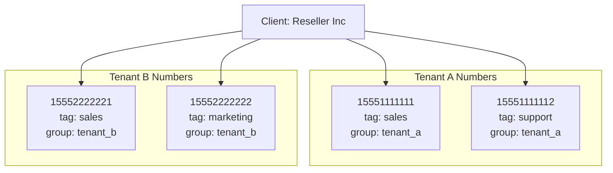

# Number Management

This document covers number organization, tagging, and multi-tenant support in GOMSGGW.

## Overview

Each `ClientNumber` in GOMSGGW can be enriched with organizational metadata to support complex multi-tenant deployments. This is especially useful for web clients acting as resellers or managing multiple downstream customers.



---

## Tagging

The `Tag` field provides arbitrary categorization for individual numbers.

### Purpose

- Identify numbers for organizational purposes
- Enable filtering and reporting
- Pass metadata to webhook consumers

### Usage Examples

```json
{
  "number": "15551234567",
  "tag": "department:sales"
}
```

```json
{
  "number": "15551234568",
  "tag": "campaign:summer_2026"
}
```

```json
{
  "number": "15551234569",
  "tag": "region:us-east"
}
```

### Tag Format

Tags are free-form strings. We recommend using a consistent format such as:
- `key:value` format (e.g., `department:sales`)
- Hierarchical format (e.g., `org/team/project`)
- Simple identifiers (e.g., `primary`, `backup`)

### Webhook Integration

Tags are included in webhook payloads delivered to web clients:

```json
{
  "id": "msg_123",
  "from": "+15559876543",
  "to": "+15551234567",
  "text": "Customer inquiry",
  "tag": "department:sales",
  "group": "tenant_a",
  "timestamp": "2026-01-06T12:00:00Z"
}
```

This allows the receiving application to route or categorize messages based on the tag.

---

## Number Groups

The `Group` field enables logical clustering of numbers.

### Purpose

- Organize numbers by tenant or customer
- Apply shared configurations to number sets
- Enable group-based usage tracking and limits
- Support multi-tenant architectures

### Multi-Tenant Example

A reseller client managing multiple downstream tenants:

| Number | Group | Description |
|--------|-------|-------------|
| `15551111111` | `tenant_acme` | ACME Corp main line |
| `15551111112` | `tenant_acme` | ACME Corp support |
| `15552222221` | `tenant_globex` | Globex sales |
| `15552222222` | `tenant_globex` | Globex marketing |

### API Usage

When adding a number (use client ID):

```bash
curl -X POST "http://localhost:3000/clients/5/numbers" \
  -H "Authorization: Basic $(echo -n 'admin:API_KEY' | base64)" \
  -H "Content-Type: application/json" \
  -d '{
    "number": "15551111111",
    "carrier": "telnyx",
    "group": "tenant_acme",
    "tag": "main_line",
    "webhook": "https://reseller.com/webhooks/acme"
  }'
```

### Group-Based Routing

Different numbers in different groups can have different webhook URLs:

```
tenant_acme → https://reseller.com/webhooks/acme
tenant_globex → https://reseller.com/webhooks/globex
```

This enables the reseller to route messages to tenant-specific endpoints.

---

## Per-Number Carrier Mapping

Each number explicitly maps to a carrier for outbound routing.

### Purpose

- Route different numbers through different carriers
- Optimize for cost, coverage, or capabilities
- Support number portability scenarios

### Example Configuration

| Number | Carrier | Reason |
|--------|---------|--------|
| `15551111111` | `telnyx` | Best rates for US-West |
| `15552222222` | `twilio` | Better MMS support |
| `15553333333` | `telnyx` | Toll-free via Telnyx |

### Carrier Selection

When sending a message:
1. The gateway looks up the source number
2. The carrier field determines the upstream provider
3. The message is dispatched via that carrier's API

---

## Per-Number Webhooks

Web clients can configure webhooks at the number level.

### Purpose

- Route inbound messages to different endpoints per number
- Support multi-tenant webhook routing
- Enable number-specific message handling

### Configuration

```json
{
  "number": "15551234567",
  "webhook": "https://app.example.com/webhooks/dept-sales"
}
```

### Webhook Selection Logic

1. Check if the destination `ClientNumber` has a `WebHook` URL
2. If set, deliver to that URL
3. If not set, fall back to client's `default_webhook` from ClientSettings
4. Error if neither configured

---

## Per-Number Limits

Numbers can have individual limits via `NumberSettings` that override `ClientSettings`.

### Hierarchy

```
NumberSettings (if > 0)
     ↓
ClientSettings
     ↓
Unlimited
```

### Example

| Entity | Limit | Effect |
|--------|-------|--------|
| Client.Settings.sms_daily_limit | 10000 | Max 10k messages across all numbers |
| Number.Settings.sms_daily_limit | 500 | Max 500 messages from this number |
| Number (no settings) | 0 | Inherits client limit (10k shared) |

### Configuration

Configure number-specific limits (use number ID):

```bash
curl -X PUT "http://localhost:3000/numbers/7/settings" \
  -H "Authorization: Basic $(echo -n 'admin:API_KEY' | base64)" \
  -H "Content-Type: application/json" \
  -d '{
    "sms_daily_limit": 500,
    "mms_daily_limit": 50,
    "limit_both": false
  }'
```

### Enforcement

Both limits are checked independently:
1. **Number check**: Is this specific number over its limit?
2. **Client check**: Is the client over their global limit?

If either check fails, the message is rejected.

See [Usage Limits](./usage_limits.md) for detailed limit enforcement logic.

---

## Best Practices

### Tagging Strategy

- Use consistent naming conventions
- Document your tag schema
- Consider using prefixed formats (`key:value`)

### Group Organization

- Create groups that map to your business structure
- Use meaningful, descriptive group names
- Consider future scaling when naming groups

### Webhook Management

- Use HTTPS endpoints exclusively
- Implement webhook signature verification
- Design for idempotency (handle duplicate deliveries)

### Number Limits

- Set client limits as a safety net
- Use number limits for tenant-specific quotas
- Monitor usage via the stats API
