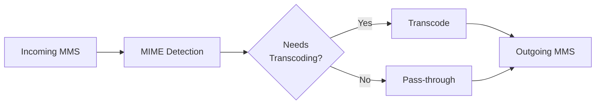

# MMS Transcoding

This document covers the MMS media normalization pipeline in GOMSGGW.

## Overview

GOMSGGW includes an intelligent transcoding system to ensure MMS messages are deliverable across all carrier networks and handset types. The system automatically processes media files to meet carrier-specific size and format requirements.



---

## Carrier Size Limits

Different carriers impose different size limits for MMS:

| Tier | Max Size | Carriers |
|------|----------|----------|
| Tier 1 | 1 MB | Some Tier-1 carriers |
| Tier 2 | 600 KB | Telnyx, most carriers |
| Tier 3 | 300 KB | Strict carriers, international |

GOMSGGW targets **Tier 2 (600 KB)** by default for maximum compatibility.

---

## Supported Media Types

### Images

| Input Format | Transcoding | Output |
|--------------|-------------|--------|
| JPEG | Resize/compress if needed | JPEG |
| PNG | Convert + compress | JPEG |
| GIF (static) | Convert | JPEG |
| GIF (animated) | Pass-through or skip | GIF |
| WebP | Convert | JPEG |
| HEIC | Convert | JPEG |

**Processing Steps:**
1. Decode the image
2. Resize if dimensions exceed target
3. Re-encode as JPEG with quality adjustment
4. Iterate quality until size target met

### Video

| Input Format | Transcoding | Output |
|--------------|-------------|--------|
| MP4 | Transcode if needed | MP4 (H.264) |
| MOV | Convert | MP4 |
| AVI | Convert | MP4 |
| WebM | Convert | MP4 |
| 3GP | Optimize | 3GP |

**Processing Steps:**
1. Analyze input video properties
2. Transcode using FFmpeg:
   - Video: H.264 baseline profile
   - Audio: AAC mono/stereo
   - Target bitrate for size compliance
3. Fallback to 3GP format for maximum compatibility

### Audio

| Input Format | Transcoding | Output |
|--------------|-------------|--------|
| MP3 | Pass-through or compress | MP3 |
| WAV | Convert | MP3 |
| M4A | Convert | MP3 |
| OGG | Convert | MP3 |
| AMR | Pass-through | AMR |

---

## Transcoding Strategies

### Adaptive Quality

The transcoder uses an iterative approach for images:

```go
// Pseudocode
quality := 85
for quality >= 50 {
    encoded := encodeJPEG(image, quality)
    if len(encoded) <= targetSize {
        return encoded
    }
    quality -= 5
}
return errorTooLarge()
```

### Dimension Limits

Maximum dimensions are enforced to reduce file sizes:

| Media Type | Max Width | Max Height |
|------------|-----------|------------|
| Images | 1920 px | 1920 px |
| Videos | 1280 px | 720 px |

### FFmpeg Integration

Video and audio transcoding uses FFmpeg with optimized profiles:

```bash
# Video transcoding example
ffmpeg -i input.mov \
  -c:v libx264 -profile:v baseline -level 3.0 \
  -c:a aac -ac 2 -b:a 128k \
  -movflags +faststart \
  -maxrate 500k -bufsize 1M \
  output.mp4
```

---

## Web Client Transcoding Control

Web clients can disable transcoding via `WebClientSettings`:

```json
{
  "disable_transcoding": true
}
```

### When Transcoding is Disabled

- Media files are passed through without modification
- Original quality is preserved
- **No size validation is performed**

> [!WARNING]
> Disabling transcoding may cause delivery failures if media exceeds carrier limits. Use only when the recipient can handle arbitrary media sizes.

### When Transcoding is Required

Even if disabled for the web client, transcoding is **always applied** when:
- The destination is a Legacy (SMPP/MM4) client
- The carrier explicitly requires transcoding
- The media type is not supported by the carrier

---

## Error Handling

### Transcoding Failures

When transcoding fails, the system:
1. Logs the error with details
2. Attempts fallback strategies:
   - Try lower quality settings
   - Try alternative format
   - Skip the problematic file
3. Sends error notification to sender (if configured)

### Size Limit Exceeded

If a file cannot be reduced to the target size:

```json
{
  "error": "media_too_large",
  "message": "Image could not be reduced to carrier limits",
  "original_size": 5242880,
  "target_size": 614400,
  "filename": "large_photo.png"
}
```

### Unsupported Format

For unrecognized media types:

```json
{
  "error": "unsupported_media_type",
  "message": "Media type not supported for MMS",
  "content_type": "application/octet-stream",
  "filename": "document.exe"
}
```

---

## Performance Considerations

### CPU Usage

Video transcoding is CPU-intensive. Consider:
- Limiting concurrent transcode operations
- Using a dedicated transcoding worker pool
- Horizontal scaling for high-volume deployments

### Temporary Storage

The transcoder uses temporary files during processing:
- Located in system temp directory
- Automatically cleaned up after processing
- Consider tmpfs for improved performance

### Caching

Transcoded media can be cached by content hash:
- Avoids re-processing identical files
- Useful for repeated sends of same media
- Configure cache size based on available storage

---

## Monitoring

### Metrics

The transcoding system exposes Prometheus metrics:

| Metric | Type | Description |
|--------|------|-------------|
| `mms_transcode_total` | Counter | Total transcode operations |
| `mms_transcode_duration_seconds` | Histogram | Transcode operation duration |
| `mms_transcode_errors_total` | Counter | Failed transcode operations |
| `mms_transcode_bytes_saved` | Counter | Bytes reduced by transcoding |

### Logging

Transcoding operations are logged at INFO level:

```json
{
  "level": "info",
  "component": "transcoder",
  "event": "transcode_complete",
  "input_type": "image/png",
  "output_type": "image/jpeg",
  "input_size": 2048576,
  "output_size": 512000,
  "quality": 75,
  "duration_ms": 245
}
```

---

## Configuration

### Environment Variables

| Variable | Default | Description |
|----------|---------|-------------|
| `MMS_MAX_SIZE` | `614400` | Target size in bytes (600KB) |
| `MMS_IMAGE_QUALITY` | `85` | Initial JPEG quality |
| `MMS_VIDEO_BITRATE` | `500k` | Target video bitrate |
| `FFMPEG_PATH` | `/usr/bin/ffmpeg` | FFmpeg binary location |
| `TRANSCODER_WORKERS` | `4` | Concurrent transcode workers |

---

## Best Practices

### For Legacy Clients

- Always leave transcoding enabled
- Trust the gateway to optimize for delivery

### For Web Clients

- Only disable transcoding if you manage media optimization
- Consider the destination when disabling
- Monitor for delivery failures

### For High Volume

- Scale horizontally for transcoding capacity
- Consider dedicated transcoding workers
- Implement media caching
