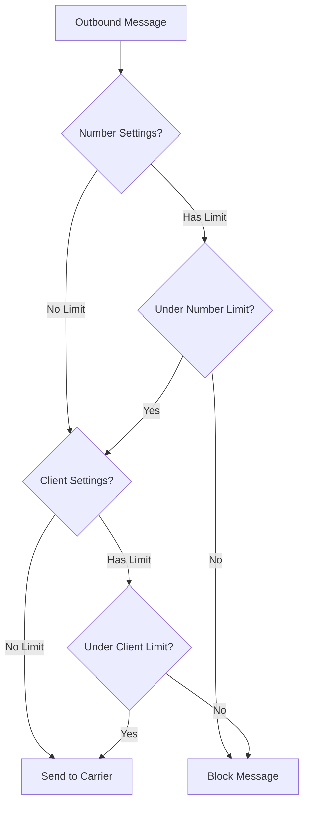

# Usage Limits

This document covers SMS/MMS quota management and rate limiting in GOMSGGW.

## Overview

GOMSGGW implements a comprehensive limit system with:
- **Separate SMS and MMS limits**
- **Three time periods**: Burst (per-minute), Daily, Monthly
- **Two-level hierarchy**: Client → Number
- **Direction control**: Outbound only (default) or both directions
- **Timezone-aware**: Periods reset at client's local midnight

---

## Limit Hierarchy



### Resolution Priority

1. **NumberSettings** (if > 0) - Per-number override
2. **ClientSettings** - Client-level default
3. **Unlimited** (0 = no limit)

---

## Limit Types

### Time Periods

| Period | Field Suffix | Description |
|--------|--------------|-------------|
| **Burst** | `_burst_limit` | Max messages per **minute** |
| **Daily** | `_daily_limit` | Max messages per **day** (resets at midnight) |
| **Monthly** | `_monthly_limit` | Max messages per **month** (resets 1st) |

### Message Types

| Type | Fields |
|------|--------|
| **SMS** | `sms_burst_limit`, `sms_daily_limit`, `sms_monthly_limit` |
| **MMS** | `mms_burst_limit`, `mms_daily_limit`, `mms_monthly_limit` |

### Direction

| Setting | Behavior |
|---------|----------|
| `limit_both: false` | Only outbound messages count (default) |
| `limit_both: true` | Both inbound and outbound count |

---

## Configuration

### Client-Level Settings

```bash
# Create client with settings
curl -X POST http://gateway:3000/clients \
  -H "Authorization: Basic $(echo -n 'admin:API_KEY' | base64)" \
  -d '{
    "username": "acme_corp",
    "name": "ACME Corporation",
    "type": "web",
    "timezone": "America/Vancouver"
  }'

# Response: {"id": 1, ...}

# Configure limits
curl -X PUT http://gateway:3000/clients/1/settings \
  -H "Authorization: Basic $(echo -n 'admin:API_KEY' | base64)" \
  -d '{
    "sms_daily_limit": 10000,
    "mms_daily_limit": 1000,
    "sms_burst_limit": 100,
    "limit_both": false
  }'
```

### Number-Level Overrides

```bash
# Add number with settings override
curl -X POST http://gateway:3000/clients/1/numbers \
  -H "Authorization: Basic $(echo -n 'admin:API_KEY' | base64)" \
  -d '{
    "number": "+15551234567",
    "carrier": "telnyx"
  }'

# Response: {"id": 5, ...}

# Configure number-specific limits
curl -X PUT http://gateway:3000/numbers/5/settings \
  -H "Authorization: Basic $(echo -n 'admin:API_KEY' | base64)" \
  -d '{
    "sms_daily_limit": 500,
    "limit_both": true
  }'
```

---

## Timezone Support

Limits reset at midnight in the **client's timezone**:

```json
{
  "username": "acme_corp",
  "timezone": "America/Vancouver"
}
```

- Daily limits reset at 00:00 Pacific Time
- Monthly limits reset on the 1st at 00:00 Pacific Time
- Default timezone: `UTC`

Supported timezones: Any valid IANA timezone (e.g., `America/New_York`, `Europe/London`)

---

## Example Scenarios

### Scenario 1: Daily SMS Limit

```
Client: SalesCo (timezone: America/Vancouver)
├── ClientSettings.sms_daily_limit: 5000
├── Number: 15551111111 (no override)
└── Number: 15552222222 (no override)
```

**Behavior**: Total of 5000 SMS per day, shared across all numbers. Resets at midnight Pacific.

### Scenario 2: Per-Number Limits

```
Client: MarketingInc
├── ClientSettings.sms_daily_limit: 0 (unlimited)
├── Number: 15551111111
│   └── NumberSettings.sms_daily_limit: 1000
└── Number: 15552222222
    └── NumberSettings.sms_daily_limit: 2000
```

**Behavior**: Each number has its own daily cap. No global limit.

### Scenario 3: Burst Rate Limiting

```
Client: HighVolume
├── ClientSettings.sms_burst_limit: 50
├── ClientSettings.sms_daily_limit: 100000
└── Number: 15551111111 (no override)
```

**Behavior**: Max 50 SMS per minute to prevent carrier throttling, up to 100k per day.

### Scenario 4: Bidirectional Limits

```
Client: SupportLine
├── ClientSettings.sms_daily_limit: 2000
├── ClientSettings.limit_both: true
└── Number: 15551111111
```

**Behavior**: 2000 messages total per day, counting **both** inbound and outbound.

---

## Enforcement Points

### Where Limits Are Checked

| Entry Point | Limit Check Type |
|-------------|------------------|
| REST API `/messages/send` | Comprehensive (burst/daily/monthly, SMS/MMS, timezone-aware) |
| SMPP `submit_sm` | Comprehensive via Router |
| Internal routing | Comprehensive via Router |

> All entry points now use the same `CheckMessageLimits()` function for consistent enforcement.

### Response on Limit Exceeded

**REST API** (`429 Too Many Requests`):
```json
{
  "error": "rate_limit_exceeded",
  "message": "SMS daily limit exceeded (500/500)",
  "limit_type": "daily_sms_number",
  "period": "daily",
  "number": "+15551234567",
  "current_usage": 500,
  "limit": 500
}
```

**SMPP**: Error code `0x00000058` (Denied by policy)

---

## Usage API

Check current usage against limits:

```bash
GET /messages/usage
Authorization: Basic <client_credentials>
```

**Response**:
```json
{
  "client": {
    "username": "acme_corp",
    "type": "web",
    "sms": {
      "burst":   {"current_usage": 5,  "limit": 50,   "remaining": 45},
      "daily":   {"current_usage": 4523, "limit": 10000, "remaining": 5477},
      "monthly": {"current_usage": 45000, "limit": 100000, "remaining": 55000}
    },
    "mms": {
      "burst":   {"current_usage": 0, "limit": 10,   "remaining": 10},
      "daily":   {"current_usage": 150, "limit": 1000, "remaining": 850},
      "monthly": {"current_usage": 2500, "limit": 10000, "remaining": 7500}
    }
  },
  "numbers": [
    {
      "number": "15551234567",
      "direction": "outbound",
      "sms": {"current_usage": 523, "limit": 500},
      "mms": {"current_usage": 50, "limit": 100},
      "limit_both": false,
      "tag": "sales"
    }
  ],
  "timezone": "America/Vancouver",
  "reset_times": {
    "burst":   "2026-01-06T15:31:00Z",
    "daily":   "2026-01-07T08:00:00Z",
    "monthly": "2026-02-01T08:00:00Z"
  },
  "timestamp": "2026-01-06T15:30:00Z"
}
```

> The `direction` field indicates that per-number usage counts outbound messages only. Set `limit_both: true` on number settings to count both directions.

---

## Best Practices

### Setting Appropriate Limits

1. **Start with daily limits** - Most common use case
2. **Add burst limits** for high-volume clients to prevent carrier throttling
3. **Use monthly limits** for billing-aligned quotas
4. **Buffer 10-20%** headroom for traffic spikes

### Multi-Tenant Limits

1. Use **NumberSettings** for tenant-specific quotas
2. Use **ClientSettings** as a global safety cap
3. Use `limit_both: true` for support lines where inbound/outbound should be balanced

### Monitoring

- Track limit violations in logs
- Alert on repeated/sustained limit triggers
- Review usage patterns monthly via `/messages/usage`
